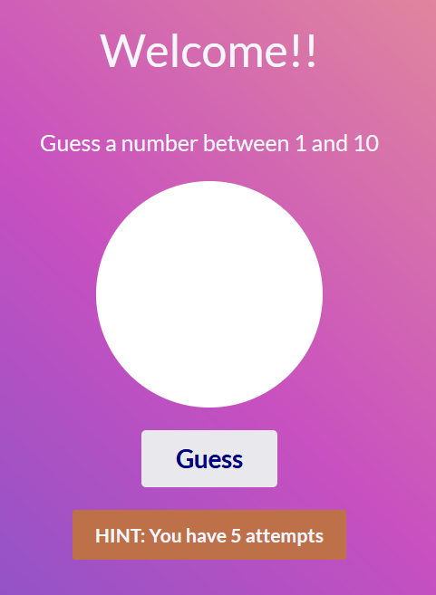

## Guessing Game

This is a fun activity where you try to correctly guess a secret number. With each guess, the number of attempts variable is updated. When the number of attempt reaches zero, the game is over. 

### Built With

  &nbsp;
  &nbsp;
  &nbsp;

## Demo
Click [here](https://bernardoyewole.github.io/guessing-game/) to play.

A demo is show below:

